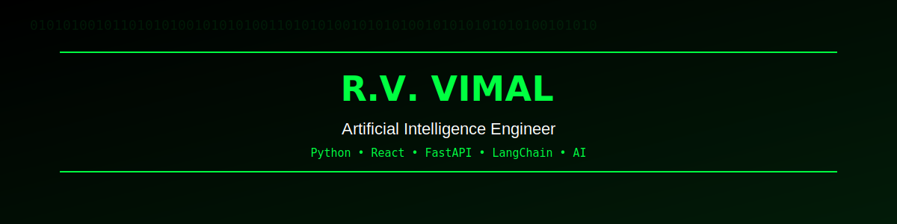
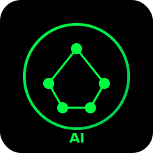
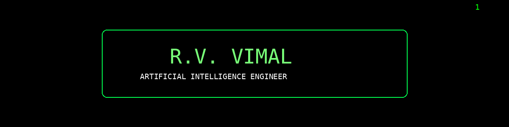

<div align="center">



<br><br>



<br><br>



<br>


<br><br>


</div>


---
## 🌐 Connect With Me

<div align="center">

<a href="https://vimal-ai-portfolio.vercel.app" target="_blank">

</a>

<a href="https://github.com/Vimalsharath" target="_blank">

</a>

<a href="https://www.linkedin.com/in/vimal-r-v-aba06b298" target="_blank">

</a>

<a href="mailto:vimal141205@gmail.com">

</a>

</div>

---

<div align="center">


</div>

---

<div align="center">

<a href="https://raw.githubusercontent.com/Vimalsharath/Vimalsharath/main/assets/Vimal%20Resume.pdf">


</a>

</div>
---

# 💻 Terminal

```bash
> whoami

Name          : R.V. Vimal

Role          : Artificial Intelligence Engineer

Education     : B.E Computer Science Engineering

College       : SRM Valliammai Engineering College

Location      : Tamil Nadu, India

Current Focus :

• Artificial Intelligence

• Large Language Models

• Retrieval Augmented Generation

• Machine Learning

• Full Stack Development

Mission :

Build AI Products That Solve Real Problems
```

---

# 🚀 About Me

```yaml
Name: R.V. Vimal

Role: AI Engineer

Languages:

  - Python

  - Java

  - JavaScript

Frameworks:

  - React

  - FastAPI

AI:

  - LangChain

  - ChromaDB

  - Groq

Currently Learning:

  - LLMs

  - RAG

  - Agentic AI

Hobbies:

  - Coding

  - Chess

  - Learning AI

Dream:

  Become an AI Engineer
```

# 💻 Tech Stack

### 🚀 Languages


---

### 🎨 Frontend


---

### ⚙️ Backend


---

### 🤖 AI / ML


---

### 🛠 Tools


---

# 📈 GitHub Stats

<div align="center">


</div>

---

# 🔥 GitHub Streak

<div align="center">


</div>

---

# 🚀 Featured Projects

<div align="center">

| 🚀 Project | 💡 Description | ⚙️ Tech |
|:----------|:---------------|:--------|
| **🤖 AI Portfolio** | AI-powered portfolio with an intelligent chatbot that answers questions about my skills, projects and experience. | `React` `FastAPI` `LangChain` `ChromaDB` `Groq` |
| **🧠 AI Resume Chatbot** | Retrieval-Augmented Generation chatbot that understands resumes and answers questions using LLMs. | `FastAPI` `LangChain` `RAG` `ChromaDB` |
| **🌦 Weather Forecast App** | Real-time weather forecasting application using OpenWeather API with responsive UI. | `HTML` `CSS` `JavaScript` `REST API` |
| **🧬 Alzheimer's Disease Prediction** | Deep Learning model for Alzheimer's prediction using CNN with ResNet50 backbone. | `Python` `TensorFlow` `CNN` `ResNet50` |

</div>

<p align="center">

<a href="https://vimal-ai-portfolio.vercel.app">

</a>

<a href="https://github.com/Vimalsharath">

</a>

</p>

---

# 📊 GitHub Activity Graph

<div align="center">


</div>

---

# 🏆 GitHub Achievements

<div align="center">


</div>

---

# 💻 Current Focus

```text
🟢 Artificial Intelligence

🟢 Machine Learning

🟢 Generative AI

🟢 LLMs

🟢 RAG

🟢 FastAPI

🟢 React

🟢 LangChain

🟢 Open Source
```

---

# 💬 Developer Philosophy

<div align="center">

> **"The best way to predict the future is to build it."**

> *Learning every day. Building with purpose. Growing through consistency.*

</div>

---


# 🐍 Contribution Snake

<div align="center">


</div>

> 💡 *Every green square represents a step forward. Consistency beats intensity.*


---

# ⚡ Fun Zone

<div align="center">


<br><br>


</div>

---

# 🎯 Current Mission

```text
🚀 Become an AI Engineer

🧠 Master LLMs & Agentic AI

⚡ Build Production-Ready AI Applications

🌍 Contribute to Open Source

📚 Solve 500+ DSA Problems

💼 Secure an AI/ML Engineer Role
```

---

# ☕ Support My Work

<div align="center">

<a href="https://github.com/Vimalsharath">


</a>

</div>

---


<div align="center">

## 💚 Thanks for Visiting!

### ⭐ If you like my work, consider giving a star to my repositories.


<br>


</div>
